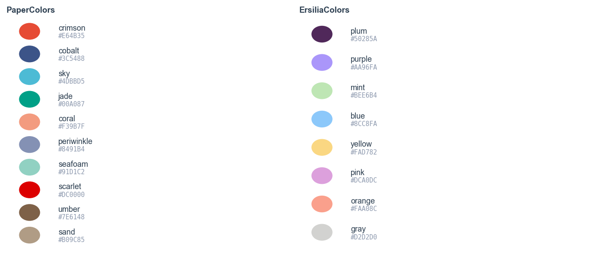
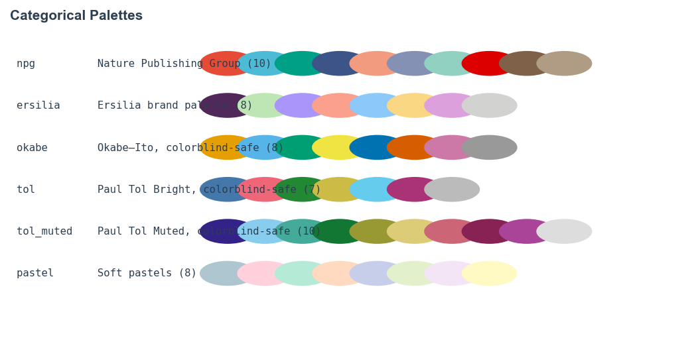
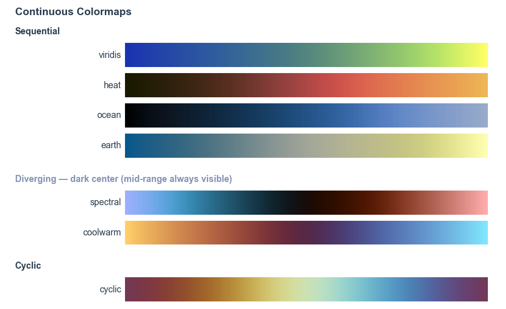

# Stylia: decent scientific plot styles

Stylia provides predefined [Matplotlib](https://matplotlib.org/) styles, color palettes, and figure utilities for producing publication-quality scientific figures. It is designed for use across all projects within the [Ersilia Open Source Initiative](https://ersilia.io) but works for any scientific Python project.

## Table of Contents

- [Installation](#installation)
- [Quick start](#quick-start)
- [Named colors](#named-colors)
- [Categorical palettes](#categorical-palettes)
- [Continuous colormaps](#continuous-colormaps)
- [Figures](#figures)
- [Sizes and constants](#sizes-and-constants)
- [About Us](#about-us)


---

## Installation

```bash
pip install stylia
```

Or from source:

```bash
git clone https://github.com/ersilia-os/stylia.git
cd stylia
pip install -e .
```

Importing `stylia` automatically applies global Matplotlib style settings (font, grid, DPI-ready PDF output):

```python
import stylia
```

---

## Quick start

```python
import numpy as np
import stylia
from stylia import PaperColors, CategoricalPalette, ContinuousColorMap, NamedColorMaps
from stylia import create_figure, save_figure

nc  = PaperColors()
pal = CategoricalPalette()        # NPG by default
ncm = NamedColorMaps()

fig, axes = create_figure(nrows=1, ncols=3)

# scatter – single named color
ax = axes[0]
ax.scatter(np.random.randn(50), np.random.randn(50), color=nc.crimson)

# bar – categorical palette
ax = axes[1]
groups = ["A", "B", "C", "D", "E"]
values = np.random.rand(5)
colors = pal.sample(len(groups))
ax.bar(groups, values, color=colors)

# heatmap – continuous colormap
ax = axes[2]
data = np.random.randn(20)
ccm = ContinuousColorMap("spectral")
ccm.fit(data)
ax.scatter(range(len(data)), data, c=ccm.transform(data))

save_figure(fig, "quickstart.pdf")
```

---

## Named colors

Two separate named-color palettes are provided. `PaperColors` (also aliased as `NamedColors`) is the default for publications — evocative names drawn from the Nature Publishing Group palette. `ErsiliaColors` contains the official [Ersilia brand colors](https://ersilia.gitbook.io/ersilia-book/styles/brand-guidelines).

### PaperColors

```python
from stylia import PaperColors

nc = PaperColors()

# access by name (RGB tuples)
nc.crimson    # #E64B35
nc.cobalt     # #3C5488
nc.sky        # #4DBBD5
nc.jade       # #00A087
nc.coral      # #F39B7F
nc.periwinkle # #8491B4
nc.seafoam    # #91D1C2
nc.scarlet    # #DC0000
nc.umber      # #7E6148
nc.sand       # #B09C85
nc.white      # #FFFFFF
nc.black      # #2C3E50

# access by index or slice (palette order, excludes white/black)
nc[0]         # crimson
nc[-1]        # sand
nc[0:3]       # [crimson, cobalt, sky]
len(nc)       # 10
list(nc)      # all 10 as a list

# get with modifiers
nc.get("crimson", alpha=0.4)    # semi-transparent
nc.get("cobalt", lighten=0.3)   # lightened

# all hex values
nc.hex   # {'crimson': '#E64B35', 'cobalt': '#3C5488', ...}
```

### ErsiliaColors

```python
from stylia import ErsiliaColors

ec = ErsiliaColors()

ec.plum     # #50285A – Ersilia primary
ec.purple   # #AA96FA – Ersilia accent
ec.mint     # #BEE6B4
ec.blue     # #8CC8FA
ec.yellow   # #FAD782
ec.pink     # #DCA0DC
ec.orange   # #FAA08C
ec.gray     # #D2D2D0
```



**PaperColors** (NPG-derived, evocative names)

| Name | Hex |
|---|---|
| `crimson` | `#E64B35` |
| `cobalt` | `#3C5488` |
| `sky` | `#4DBBD5` |
| `jade` | `#00A087` |
| `coral` | `#F39B7F` |
| `periwinkle` | `#8491B4` |
| `seafoam` | `#91D1C2` |
| `scarlet` | `#DC0000` |
| `umber` | `#7E6148` |
| `sand` | `#B09C85` |

**ErsiliaColors** (official Ersilia brand palette)

| Name | Hex |
|---|---|
| `plum` | `#50285A` |
| `purple` | `#AA96FA` |
| `mint` | `#BEE6B4` |
| `blue` | `#8CC8FA` |
| `yellow` | `#FAD782` |
| `pink` | `#DCA0DC` |
| `orange` | `#FAA08C` |
| `gray` | `#D2D2D0` |

---

## Categorical palettes

`CategoricalPalette` cycles through a set of distinct colors for categorical data. Use `.sample(n)` to get `n` colors, or `.next()` to draw one at a time.

```python
from stylia import CategoricalPalette

# default: NPG (Nature Publishing Group)
pal = CategoricalPalette()
pal = CategoricalPalette("npg")       # same
pal = CategoricalPalette("ersilia")   # Ersilia brand colors
pal = CategoricalPalette("okabe")     # Okabe–Ito (colorblind-safe)
pal = CategoricalPalette("tol")       # Paul Tol Bright (colorblind-safe, ≤7)
pal = CategoricalPalette("tol_muted") # Paul Tol Muted (colorblind-safe, ≤10)
pal = CategoricalPalette("pastel")    # soft pastels

# list all presets
CategoricalPalette.available()
# ['npg', 'ersilia', 'okabe', 'tol', 'tol_muted', 'pastel']

# usage
colors = pal.sample(5)    # list of 5 RGB tuples
color  = pal.next()       # draw one (advances internal counter)
pal.reset()               # restart counter

# shuffle order on creation
pal = CategoricalPalette("npg", shuffle=True)

# pass a custom list of hex colors
pal = CategoricalPalette(["#E64B35", "#4DBBD5", "#00A087"])
```



**Palette overview**

| Preset | Colors | Notes |
|---|---|---|
| `npg` | 10 | Nature Publishing Group standard |
| `ersilia` | 8 | Official Ersilia brand palette |
| `okabe` | 8 | Colorblind-safe (Okabe–Ito) |
| `tol` | 7 | Colorblind-safe (Paul Tol Bright) |
| `tol_muted` | 10 | Colorblind-safe (Paul Tol Muted) |
| `pastel` | 8 | Soft pastels for low-emphasis use |

**Example – grouped bar chart**

```python
import numpy as np
import stylia
from stylia import CategoricalPalette, create_figure, save_figure

pal = CategoricalPalette("npg")
groups = ["Control", "Treatment A", "Treatment B", "Treatment C"]
values = [0.45, 0.72, 0.61, 0.88]
colors = pal.sample(len(groups))

fig, axes = create_figure(nrows=1, ncols=1)
axes[0].bar(groups, values, color=colors, edgecolor="none")
save_figure(fig, "bars.pdf")
```

---

## Continuous colormaps

`NamedColorMaps` gives direct access to colormaps by name. `ContinuousColorMap` maps a numeric array to colors, with optional quantile normalisation for better contrast.

### Named colormaps

All colormaps are chosen so that **every data value is visible on a white
background**. The key problem with conventional diverging maps (Spectral,
coolwarm) is a near-white center that makes mid-range values invisible.
Stylia uses dark-center diverging maps to solve this.

```python
from stylia import NamedColorMaps

ncm = NamedColorMaps()                  # scientific cmcrameri colormaps (default)
ncm = NamedColorMaps(scientific=False)  # standard Matplotlib colormaps

# sequential — dark start, no white endpoints
ncm.viridis   # dark blue → bright yellow-green    (cmcrameri: imola)
ncm.heat      # near-black brown → orange-red       (cmcrameri: lajolla, clipped)
ncm.ocean     # dark navy → steel blue              (cmcrameri: oslo, clipped)
ncm.earth     # cold blue → warm yellow-green       (cmcrameri: nuuk)

# diverging — DARK CENTER so mid-range values are never invisible on white
ncm.spectral  # periwinkle-blue <-> salmon-red, center ~black   (cmcrameri: berlin)
ncm.coolwarm  # golden-yellow <-> sky-cyan, center ~dark purple  (cmcrameri: managua)

# cyclic (phase / angle data)
ncm.cyclic    # smooth cyclic wrap  (cmcrameri: romaO)

# access by string
ncm.get("spectral")
ncm.available  # ['viridis', 'heat', 'ocean', 'earth', 'spectral', 'coolwarm', 'cyclic']

# use directly with Matplotlib
ax.scatter(x, y, c=values, cmap=ncm.spectral)
```



**Why dark-center diverging maps?**

| Colormap | Old (center lightness) | New (center lightness) |
|---|---|---|
| `spectral` | roma – 0.84, near-white | berlin – **0.07**, near-black |
| `coolwarm` | vik – 0.90, near-white | managua – **0.25**, dark purple |

### Fitting to data

`ContinuousColorMap` fits a quantile transformation to the data so low-density regions of the value distribution still show distinct colors.

```python
from stylia import ContinuousColorMap
import numpy as np

data = np.random.randn(200)

ccm = ContinuousColorMap("spectral")                          # uniform quantile transform (default)
ccm = ContinuousColorMap("heat",    transformation="normal") # normal quantile transform
ccm = ContinuousColorMap("viridis", transformation=None)     # raw values, percentile clip only
ccm = ContinuousColorMap("coolwarm", ascending=False)        # reverse mapping direction

ccm.fit(data)
colors = ccm.transform(data)   # list of RGBA tuples, one per data point

# with modifiers
colors = ccm.get(data, alpha=0.6, lighten=0.2)

# evenly-spaced color samples (e.g. for a legend)
swatches = ccm.sample(8)
swatches = ccm.sample(8, shuffle=True)
```

**Example – scatter with continuous color**

```python
import numpy as np
import stylia
from stylia import ContinuousColorMap, NamedColorMaps, create_figure, save_figure

x = np.random.randn(300)
y = np.random.randn(300)
z = x ** 2 + y ** 2   # color by distance from origin

ccm = ContinuousColorMap("spectral", ascending=False)
ccm.fit(z)

fig, axes = create_figure()
axes[0].scatter(x, y, c=ccm.transform(z), s=20, linewidths=0)
save_figure(fig, "scatter.pdf")
```

---

## Figures

### Creating a figure

`create_figure` returns a styled `(fig, axes)` pair. Axes are automatically formatted with the Stylia style.

```python
from stylia import create_figure, save_figure

# single panel
fig, axes = create_figure()
ax = axes[0]

# multi-panel
fig, axes = create_figure(nrows=1, ncols=3)
ax0, ax1, ax2 = axes[0], axes[1], axes[2]

# two-column width (7.09 in) instead of one-column (3.45 in)
fig, axes = create_figure(ncols=2, one_column=False)

# custom width/height ratios
fig, axes = create_figure(ncols=3, width_ratios=[2, 1, 1])
```

### Labels and styling

```python
from stylia.figure.axes import label, stylize

label(ax, xlabel="Time (h)", ylabel="OD600", title="Growth curve")
stylize(ax)   # removes top/right spines, tightens tick padding
```

### Saving

```python
save_figure(fig, "figure1.pdf")    # 600 DPI, tight layout, PDF-safe fonts
save_figure(fig, "figure1.png")
```

---

## Sizes and constants

Import constants directly for consistent sizing across all figures in a project.

```python
from stylia import (
    FONTSIZE_SMALL,    # 5 pt
    FONTSIZE,          # 6 pt
    FONTSIZE_BIG,      # 8 pt
    MARKERSIZE_SMALL,  # 5
    MARKERSIZE,        # 10
    MARKERSIZE_BIG,    # 30
    LINEWIDTH,         # 0.5
    LINEWIDTH_THICK,   # 1
    ONE_COLUMN_WIDTH,  # 3.45 in
    TWO_COLUMNS_WIDTH, # 7.09 in
)
```

| Constant | Value | Use |
|---|---|---|
| `FONTSIZE_SMALL` | 5 pt | axis tick labels, annotations |
| `FONTSIZE` | 6 pt | axis labels, legend |
| `FONTSIZE_BIG` | 8 pt | panel titles |
| `MARKERSIZE_SMALL` | 5 | dense scatter |
| `MARKERSIZE` | 10 | standard scatter |
| `MARKERSIZE_BIG` | 30 | highlighted points |
| `LINEWIDTH` | 0.5 | standard lines, spines |
| `LINEWIDTH_THICK` | 1 | emphasis lines |
| `ONE_COLUMN_WIDTH` | 3.45 in | single-column journal figure |
| `TWO_COLUMNS_WIDTH` | 7.09 in | double-column journal figure |

---

## Disclaimer

Stylia is designed for internal use across Ersilia projects and is shared openly in case it is useful to others. It is not a general-purpose plotting library — for that, see [Matplotlib](https://matplotlib.org/) or [seaborn](https://seaborn.pydata.org/).

## About Us

Learn about the [Ersilia Open Source Initiative](https://ersilia.io)!
