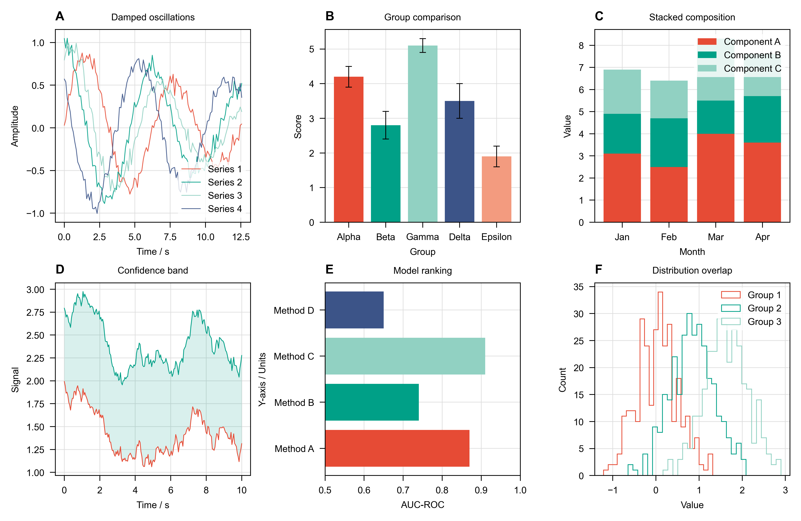
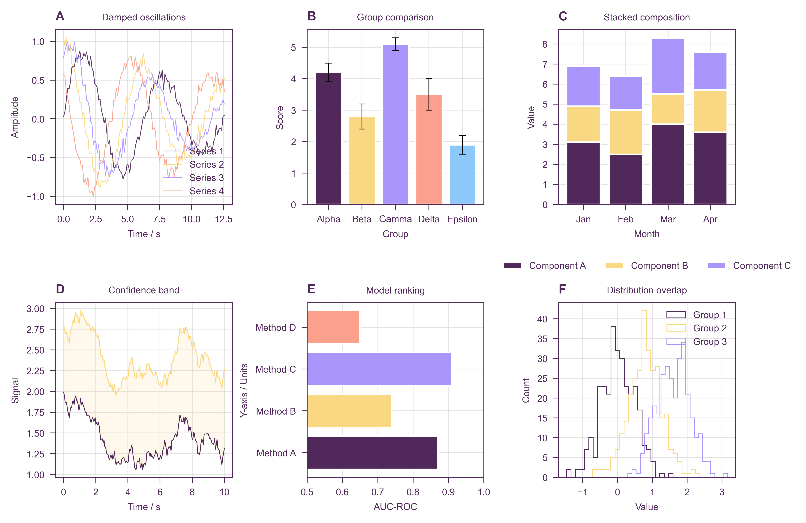

# Stylia: decent scientific plot styles

Stylia provides predefined [Matplotlib](https://matplotlib.org/) styles, color palettes, and figure utilities for producing publication-quality scientific figures. Designed for the [Ersilia Open Source Initiative](https://ersilia.io), but works for any scientific Python project.

**Article style** (default — NPG palette, black structural elements)



**Ersilia style** (Ersilia brand palette, plum structural elements)



---

## Installation

```bash
pip install stylia
```

Importing `stylia` automatically applies global Matplotlib style settings:

```python
import stylia
```

---

## Table of Contents

- [Format and style](#format-and-style)
- [Named colors](#named-colors)
- [Categorical palettes](#categorical-palettes)
- [Continuous colormaps](#continuous-colormaps)
- [Figures](#figures)
- [Sizes and constants](#sizes-and-constants)

---

## Format and style

```python
stylia.set_format("print")   # default — compact, 7.09 in wide
stylia.set_format("slide")   # larger fonts and markers, 13 in wide

stylia.set_style("article")  # default — structural elements in black
stylia.set_style("ersilia")  # structural elements in Ersilia plum
```

Both update `matplotlib.rcParams` globally and can be changed at any point.

---

## Named colors

### ArticleColors

Modern palette spanning the full hue wheel for maximum distinctness. Also aliased as `PaperColors`.

| | Name | Hex |
|---|---|---|
|  | `crimson` | `#E63946` |
|  | `tangerine` | `#F4845F` |
|  | `amber` | `#FCBF49` |
|  | `lime` | `#6BBF59` |
|  | `turquoise` | `#2EC4B6` |
|  | `cobalt` | `#457B9D` |
|  | `periwinkle` | `#6C5CE7` |
|  | `orchid` | `#B05CC8` |
|  | `fuchsia` | `#E91E8C` |
|  | `silver` | `#A0A0A0` |

```python
from stylia import ArticleColors

nc = ArticleColors()
ax.scatter(x, y, color=nc.crimson)
ax.scatter(x, y, color=nc.get("cobalt", alpha=0.4))
ax.scatter(x, y, color=nc.get("turquoise", lighten=0.3))
```

### ErsiliaColors

Official [Ersilia brand palette](https://ersilia.gitbook.io/ersilia-book/styles/brand-guidelines).

| | Name | Hex |
|---|---|---|
|  | `plum` | `#50285A` |
|  | `purple` | `#AA96FA` |
|  | `mint` | `#BEE6B4` |
|  | `blue` | `#8CC8FA` |
|  | `yellow` | `#FAD782` |
|  | `pink` | `#DCA0DC` |
|  | `orange` | `#FAA08C` |
|  | `gray` | `#D2D2D0` |

### NamedColors (style-aware)

`NamedColors` resolves to `ArticleColors` or `ErsiliaColors` based on the active style:

```python
nc = stylia.NamedColors()   # ArticleColors or ErsiliaColors depending on set_style()
```

---

## Categorical palettes

```python
from stylia import CategoricalPalette

pal = CategoricalPalette()              # default: npg
pal = CategoricalPalette("ersilia")
pal = CategoricalPalette("okabe")       # colorblind-safe
pal = CategoricalPalette("tol")         # colorblind-safe, ≤7
pal = CategoricalPalette("pastel")

colors = pal.get(5)     # 5 maximally distinguishable colors
colors = pal.get(20)    # >palette size: interpolated as a colormap
color  = pal.next()     # draw one (advances internal counter)
```

**npg** — redesigned for maximum hue coverage

         

**ersilia** — Ersilia brand

       

**okabe** — Okabe–Ito (colorblind-safe)

       

**tol** — Paul Tol Bright (colorblind-safe)

      

**pastel** — soft pastels

       

---

## Continuous colormaps

Four families, all built from ArticleColors tones. All share `fit(data)` / `transform(data, alpha=, lighten=)` / `sample(n)`.

### FadingColormap

Near-white → single hue. Good for density or strictly positive data.

| | Preset | Range |
|---|---|---|
|  | `crimson` | blush → vivid red (default) |
|  | `cobalt` | pale sky → steel blue |
|  | `turquoise` | pale mint → teal-cyan |
|  | `orchid` | pale lavender → orchid |
|  | `lime` | pale green → lime |

### SpectralColormap

Multi-hue warm → cool. Good for ordered data where the full range matters.

| | Preset | Range |
|---|---|---|
|  | `npg` | crimson → amber → turquoise → periwinkle → fuchsia |

### DivergingColormap

Two hues through a light center. Good for data diverging around a meaningful midpoint.

| | Preset | Range |
|---|---|---|
|  | `crimson_cobalt` | red ↔ steel blue |
|  | `amber_periwinkle` | amber ↔ blue-violet |

### CyclicColormap

Wraps back to its starting color. Good for phase or angle data.

| | Preset | Cycle |
|---|---|---|
|  | `npg` | crimson → tangerine → lime → turquoise → orchid → crimson |

### Usage

```python
from stylia import FadingColormap, DivergingColormap

ccm = FadingColormap("turquoise")
ccm.fit(data)
colors = ccm.transform(data)                 # list of RGBA tuples
colors = ccm.transform(data, alpha=0.6)     # with alpha
colors = ccm.transform(data, lighten=0.3)   # lightened
swatches = ccm.sample(8)                    # 8 evenly-spaced swatches

dcm = DivergingColormap("crimson_cobalt", ascending=False)
dcm.fit(data)
colors = dcm.transform(data)
```

---

## Figures

```python
import stylia

stylia.set_format("print")
stylia.set_style("article")

fig, axs = stylia.create_figure(2, 1, width=0.8, height=0.3)

ax = axs.next()
ax.scatter(x, y, color=nc.crimson, s=stylia.get_markersize())

ax = axs.next()
ax.bar(groups, values, color=pal.get(len(groups)))

stylia.save_figure("figure.pdf")
```

`create_figure` accepts `width` and `height` as fractions of the format's base size. `axs.next()` steps through panels in order.

---

## Sizes and constants

All parameters have `print` and `slide` variants applied automatically by `set_format()`.

`SIZE` is the figure width basis — `7.09 in` for `print`, `13 in` for `slide`. Use `stylia.get_size()` to read it at runtime. `width` and `height` in `create_figure` are fractions of `SIZE`.

| Constant | print | slide | Use |
|---|---|---|---|
| `FONTSIZE_SMALL` / `SLIDE_FONTSIZE_SMALL` | 5 pt | 8 pt | tick labels, annotations |
| `FONTSIZE` / `SLIDE_FONTSIZE` | 6 pt | 10 pt | axis labels, legend |
| `FONTSIZE_BIG` / `SLIDE_FONTSIZE_BIG` | 8 pt | 13 pt | panel titles |
| `MARKERSIZE_SMALL` / `SLIDE_MARKERSIZE_SMALL` | 5 | 8 | dense scatter (`s=`) |
| `MARKERSIZE` / `SLIDE_MARKERSIZE` | 10 | 15 | standard scatter (`s=`) |
| `MARKERSIZE_BIG` / `SLIDE_MARKERSIZE_BIG` | 30 | 45 | highlighted points (`s=`) |
| `LINEWIDTH` / `SLIDE_LINEWIDTH` | 0.5 | 0.75 | lines, spines |
| `LINEWIDTH_THICK` / `SLIDE_LINEWIDTH_THICK` | 1 | 1.5 | emphasis lines |

Use `stylia.get_markersize()` to get the format-aware value at runtime (`"small"`, `"normal"`, or `"big"`).

---

## Disclaimer

Stylia is designed for internal use across Ersilia projects and is shared openly in case it is useful to others. It is not a general-purpose plotting library — for that, see [Matplotlib](https://matplotlib.org/) or [seaborn](https://seaborn.pydata.org/).

---

## About Us

<a href="https://ersilia.io" target="_blank"></a>

Stylia is developed and maintained by the [Ersilia Open Source Initiative](https://ersilia.io), a non-profit organisation dedicated to providing open-source AI/ML tools for infectious disease research in the Global South.

[Visit us](https://ersilia.io) · [GitHub](https://github.com/ersilia-os) · [Twitter](https://twitter.com/ersiliaio)
